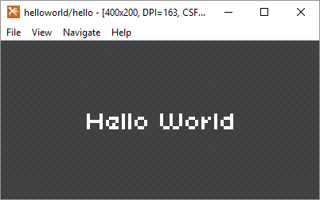
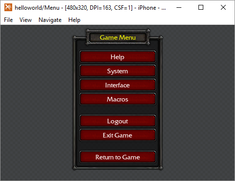
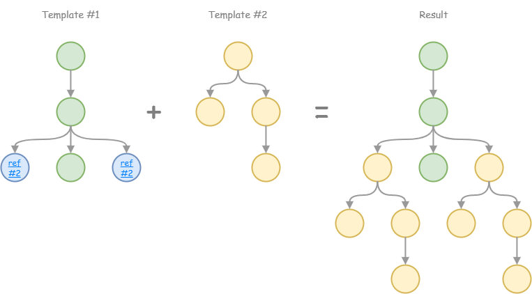

# Talon
Talon is UI toolkit for responsive interface building:

- Use *XML syntax* for declarative markup interface
- Apply *CSS dialect* for easy skinning and styling
- Build interface with *responsive layouts*
- Localize using *properties* files
- View interface outside your app with *talon browser*

Checkout detailed [documentation](./docs/index.md).

## Getting Started!

1. Download and install Talon Browser from [last release](https://github.com/Maligan/Talon/releases/latest)
2. Create new folder `helloworld`
3. Create new file `hello.xml` in `helloworld` folder:

	```xml
	<def ref="Hello">
		<txt text="Hello World" fontSize="32px" fontColor="white" />
	</def>
	```

4. Open folder in browser (via `File -> Open`)
5. Open template in browser (`Navigate -> Go To Template` or <kbd>Ctrl</kbd> + <kbd>P</kbd>) and you will see:  

	

	Awesome! You did it!

## How browser works?

Talon Browser follow [interactive programming](https://en.wikipedia.org/wiki/Interactive_programming) approach — it start watch any file within opened folder (recursively).  
And after any changes browser try to reload file and refresh result.

Let's plunge into memories and create more complex example. For this add next files into `helloworld` folder:

1. Template `menu.xml`

	```xml
	<def ref="Menu">
		<div class="Menu">
			<txt id="header" text="$menu.header" />
			<div id="buttons" layout="flow" orientation="vertical" top="16px">
				<txt text="$menu.help" />
				<txt text="$menu.system" />
				<txt text="$menu.interface" />
				<txt text="$menu.macros" marginBottom="16px" />
				<txt text="$menu.logout" />
				<txt text="$menu.exit" marginBottom="16px"/>
				<txt text="$menu.return" />
			</div>
		</div>
	</def>
	```
2. Properties `lang.props` (read more about *.properties* file format on [wikipedia article](https://en.wikipedia.org/wiki/.properties))

	```properties
	menu.header = Game Menu
	menu.help = Help
	menu.system = System
	menu.interface = Interface
	menu.macros = Macros
	menu.logout = Log Out
	menu.exit = Exit Game
	menu.return = Return to Game
	```

3. Stylesheet `menu.css`  
   Do not try to understand all of properties just now (they are not same as in W3C CSS) they are explained in [other articles](#whats-next).

	```css
	.Menu {
		/* Background */
		fill: $dialog-border;
		fillStretchGrid: 16px;
		/* Font */
		fontName: FrizQuadrata;
		fontSize: 13px;
		fontColor: white;
		/* Layout */
		padding: 16px;
	}

	.Menu #header {
		/* Background */
		fill: $dialog-header;
		fillStretchGrid: 16px;
		/* Font */
		fontColor: yellow;
		align: center;
		/* Layout */
		padding: 16px 16px 12px;
		minWidth: 139px;
		top: -30px;
	}

	.Menu #buttons txt { 
		/* Background */
		fill: $button-up;
		fillStretchGrid: 8px;
		/* Text */
		text: Button;
		align: center;
		/* Layout */
		padding: 10px 8px 6px;
		width: 160px; /* 127px; */
		/* Mouse */
		touchMode: leaf;
		touchEvents: true;
		cursor: button;
	}

	.Menu #buttons txt:hover {
		filter: brightness(0.05);
	}

	.Menu #buttons txt:active {
		fill: $button-down;
	}
	```

4. And this carefully picked up coin image `coin.png`

	

Each of files will be loaded and processed according to theirs content. From `menu.xml` will be created new template — *Menu*, styles from `menu.css` will be merged to global style scope and `coin.png` will be loaded as picture:



Do you have a flashback? I do.

## Templating
Advantages of [wise templating](https://en.wikipedia.org/wiki/Code_reuse#Criticism) are simplicity in apps, speed up development and in my opinion main one - saving developers nerves.

Template — reusable tree of elements. It can be *applied* at any **leaf** node of another template.



There are two sintax way to apply template in TML — via ref and via tag, go look at this methods on next example.

Add new `bank.xml`:

```xml
<lib>
	<def ref="BankPopup">
		<node>
			<!-- Insert template via ref -->
			<use ref="BankPopup_Product" update="id: buy1; price: 10" />	
			<!-- Insert template via tag -->
			<product id="buy10" price="50" />
		</node>
	</def>

	<def ref="BankPopup_Product" tag="product">
		<txt text="@price" />
	</def>

	<style>
		.BankPopup {
			fill: $popup;
		}

		.BankPopup_Product {
			fill: $popup_product;
		}
	</style>

	<props>
		bank.header = Bank
		bank.buy = Buy
	</props>
</lib>
```

Let's go see new used features in this example:

* First you can see new tag `<lib>` it is container which allow assemble templates, styles, properties in one file (via `<def>`, `<style>` and `<props>` tags). With libs you can keep clean file hierarchy.

* There are two way for insert template — via unique *ref* identifier with optional *update* attributes, or via linkage template to tag. This ways give 100% identical results. Good practice - use tag-method if you need global template, or use-method if you need local template.

* And last one feature — `@-notation` witch allow bind any node attribute to value of *template root* attribute. Binded attrubutes changes together.


<!--Beside new `def` attribute `tag` you can notice attriubtes *binding* (via *@-notation*). If you are not familiar with [data binding](https://en.wikipedia.org/wiki/Data_binding) technique it's not a problem — *@-notation* just bind attribute to *template root* attribute. Binded attributes changes together.-->

## Import layouts into apps

If you use talon not only for mockups, once you need import you layouts into app. There are **really many ways** to do it, let show easiest:

1. Pack to zip-archive via `File -> Publish As...` (or <kbd>Ctrl</kbd> + <kbd>Shift</kbd> + <kbd>S</kbd>)
2. Place zip-archive into source path folder, add it to compile with `[Embed]` meta tag.
3. Load embedded data to `starling.extensions.TalonFactory`, and use it to instantiate template.

For example go change [Starling's First Steps: Create your Game](http://gamua.com/starling/first-steps/) application and expand it with talon facotry:

```actionscript
import starling.display.Sprite;
import starling.extensions.TalonFactory;

public class Game extends Sprite
{
	[Embed(source="helloworld.zip")]
	private static const helloworld_zip:Class;

	public function Game()
	{
		var talon:TalonFactory = new TalonFactory();

		talon.importArchiveAsync(new helloworld_zip(), function():void
		{
			addChild(talon.build("BankPopup") as Sprite);
		}
	}
}
```

Build and run the app, if you are lucky then you can see:


GG, Easy.

## What's next?
After this introduction article I recommend you checkout detailed documentation
* [**Documentation**](docs/index.md)

For jedi mode you can learn talon by code references
* [AS3 reference](./css.md) — runtime API for Action Script & Starling FW
* [CSS reference](./css.md) — list of **all** attributes implemented within talon
