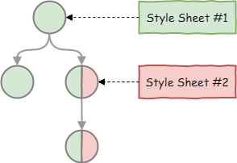

## Talon Basics
The main and only Talon building block is *Node*, which:

* Has visible *bounds* — rectangle
* Has *attributes* — key-value pairs
* Can contain *children* nodes
* Can contain attached *style sheet* and *resource dictionary*

Combine nodes into trees allow create complex UI.

### Attribute
Attribute is **key-value pair** where key — unique *string* identifier within node, value — *string* which calculated in 4 steps:

1. The basis is *default* attribute value
2. If attribute has value *style sheet* it overwrite value
3. If attribute has explicit value via *code or markup* it overwrite value
4. If attribute must respect values of other attributes:
	* If attribute must inherit value from parent then parent node attribute used  
	For example `fontColor` if setuped into `inherit` then concrete value fetched from parent node
	* If attribute must merge values from other attrubes then value calculated  
	For example `padding` = `paddingTop paddingRight paddingBottom paddingLeft`

There is only **one mandatory attribute** — `type`, it define node behaviour, used attributes, ect. Talon from the box define and implement three types: `div`, `txt`, `img` they will be described in detail below.

### Styles & Resources

I hope you are familiar with Cascading Style Sheets — if no then [wikipedia article](https://en.wikipedia.org/wiki/Cascading_Style_Sheets) is quite well else you must understand some basics of Talon's CSS implementation:

* W3C's and Talon's CSS dialects **is not the same thing**
* Styles used in attribute value calculation process (which described above in *step 2*)
* Style Sheet can be attached to any node

As it was written — style sheet can be attached to *any* node, and style sheet will affect node and *all node's descendants*. In case node descendant have its own style sheet — styles will be merged and conflicting styles will be resolved with priority of descendant's style sheet.

But in most case use only one style sheet attached to root node is good solution — keep it simple.

Sometimes you need non-string attribute value — for example node's `fill` attribute can refer to texture for display backgound image. For such cases talon use *resource table* — it is simple mapping from string key to object of any type (like image). Resource table like style sheet can be attached to node and after it will be accessible from any descendants nodes.

> For do mapping to resource attribute *value* must be in *$-notation*:
* `$KEY` for keys which contains only alphanumeric chars (strictly `[\w\d-$]+` regexp)
* `$("KEY")` for any others keys

### Types `div`, `txt`, `img`

There are three basic node's type which in my opinion occupy 95% of GUI — container, text, image. Any of this type has its own semantic and must be used in accordance with it. Nevertheless they can replace each other in some moments, for optimization reasons.

Each of type define node behaviors and attributes which are respected by node:

* `div` it is type of container. Purpose of container - contain other nodes (sorry for tautology). Main attribute used by this type — `layout`, it define children arrange methods, this will be explained in [layouts article](layouts.md).

* `txt` it is type of text. For display text in GUI — it takes `text` attribute from node and draw it.

* `img` it is type of image. This is semanticaly images like icons, avatars, etc. If map `source` attribute to image in resource dictionary it will be drawn.  
