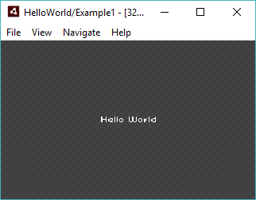

### Hello World Layout

1. Скачайте и установите [Talon Browser]()
2. Создайте новую папку `helloworld`
3. Откройте созданную папку в браузере (`File -> Open`)
4. Создайте новый файл шаблона `hello.xml` в каталоге `helloworld` со следующим содержимым:

	```xml
	<def ref="hello">
		<label text="Hello World" />
	</def>
	```

5. Откройте шаблон `hello` в браузере (`Navigate -> Go To Template` или <kbd>Ctrl + P</kbd>) и вы увидите:  

	


Ну вот и всё - вы молодец! Теперь если хотите можно несколько усложнить прмер для демонстрации работы талона. Но прежде позвольте дать заметку как работает браузер:

> Talon Browser использует идиологию livecoding, т.е. открывая любую дирректорию браузер начинает следить за добавлением/изменением/удалением любого файла которого он найдёт (рекурсивно) и будет перестраивать отображение на лету

### Display Tree and Templates

Добавте новый файл `Button.xml` в папку со следующим содержимым:

```xml
<def ref="Button">
	<node>
		<label text="Buy" />
		<image src="$coin" />
		<label text="3" />
	</node>
</def>
```

В данном примере использованы 3 типа терминалов: `node`, `label`, `image` собственно это всё что есть из коробки в талоне, эдо базовые строительные кирпичики: контейнет, текст, изображение - большое число интерфейсов (но не все) можно легко создать композицией этих трёх элементов. На этом и основана идея talon.


<!--
- _<def>_
- _<use>_


<def ref="flash.display.SimpleButton" tag="button">
	<node>
		<label />
		<label />
		<label />
	</node>
</def>

<def>
	<use ref="flash.display.SimpleButton" />
	<button />
</def>


> «Списывание с одного источника — плагиат, с двух — компиляция, с трех и более — диссертация»

- XSLT — Это очень мощный инструмент общего пользования, хоть его сложность в разы меньше его мощности всё равно для моих целей он казался ядерной боеголовкой для охоты на уток. Тем не менее основной принцип что xslt - это набор шаблонов и трансформаций связаных с ними я позаимсвовал, но сильно упростив систему трансформации.
- XInclude — был удивлён когда нашёл этот механизм, очень маленький и симпотичный, но как бы это забавно небыло его функционала явно мне не достаточно было - едиственное что он позваляет - включать один xml документ (или его часть) в другой.
- TAL — это было почти точное поподание по функицоналу того что мне нужно было, хотя в ?них? есть немного императивной логики, но они попали в точку - в них ввыводится 4 основных типа изменения дерева - замена контента, замена узла, замена аттрибутов и добавление узлов. Но мне как-то оказался не мила идея использования аттрибутов для шиблонизации, мне как-то больше по душе были синтаксис основаный на тегах как в XSLT и XInclude.

### Базовые принципы
- *Шаблон* — именованное дерево элементов.
- *Элемент* — бывают 2х типов:
	1. Терминальный
	2. Не терминальный — это шаблон и быть может набор перезаписей.
- *Перезапись* — 

Немного увёкшись формальными граматиками мне понравилась та аналогия которую мне удалось провестио
Шаблон - это дерево элементов и возможно набор трансофрмаций над ним
Дерево - состоиз из одельных узлов-элементов
Каждый элемент может быть двух типов - терминалом и не терминалом.
Терминал это примитивный узел который является базовым кирпичиком. (на примере html - это те самые div и span)
Не терминал - это поддерево - шаблон т.е. поддерево и набор трансформаций над ним
Таким образом при сборке интерфейса - это всегда набор только терминальных узлов, но на этапе макета? его можно сильно сжать изпользую шаблоны

### Трансофрмации
- replace
- content
- attributes

### Ключевые теги
Tag-Keywords:
- `rewrite` - replace any subtree on exists tree pattern (consist from 1 child (root) if mode==replace, any count of child if mode==content, empty if mode==attributes)
	+ `ref` - mandatory subtree root id
	+ `mode` - attributes / replace / content
- `template` - create tree pattern (consists from only 1 child (root))
	+ `id` - mandatory
	+ `type` - linkage tag name
- `library` - use as container for define, style и другие
- `style` - use to add css in library (without create addition .css file)

-->
