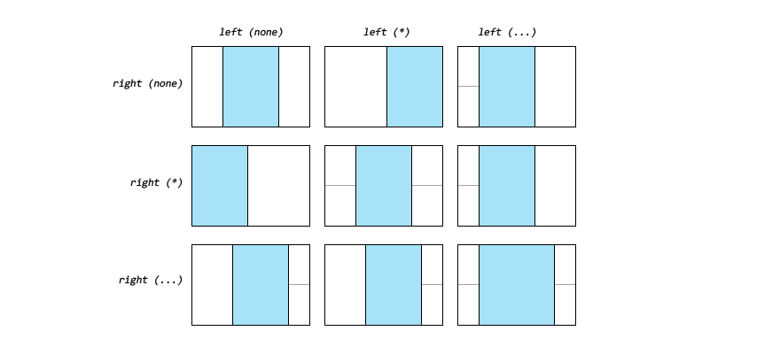

## Layouts

### Talon Box Model
Talon Box Model - simplified analog of [CSS Box Model](http://www.w3.org/TR/CSS21/box.html). Simplification is that there is *no border* only content, margin and padding.
This model must be respected by all layout algorithms, but but without fanaticism, only as a recommendation.

### Gauge & Units
Как измерять, в чём задавать, что такое звёздочка

### Layout: Anchor

* Родительские аттрибуты: `padding`
* Дочерние аттрибуты: `left`, `right`, `top`, `bottom`, `width` (`minWidth`, `maxWidth`), `height` (`minHeight`, `maxHeight`)

Положение элемента не зависит от соседних элементов.

Положения элемента по вертикали и горизонтали - равнозначны и независимы друг от друга, всё что применимо к `left`/`width`/`right` точно так же применимо к `top`/`height`/`bottom`, дальше чтобы не раздувать текст я буду говорить только о горизонтальной составляющей:

Основная логика данного алгоритма выглядит так: значения `left` — устанавливает расстояние от *левой* границы родительского элемента до *левой* границы дочернего элемента, соответственно `right` — от *правой* границы родительского элемента до *правой* границы дочернего.

Существует 4 варианта поведения расстановки элемента в зависимости от значения `left` и  `right` — в сочетании значении `none` and **не** `none`, не по поскольку данный алгоритм позволяет измпользовать *звёзды* в качестве единицы измерения, то поведение алгоритма несколько отличается при их использовании, по этому расмотрим 9 вариантов (`none`, `*` и `px, pt, mm ...etc.`) часть из которых повторят друг друга:

Если одновременно заданы `left` и `right` то значения `width` (`minWidth`, `maxWidth`) будут игнорироватся, а фактическая ширина будет вычислена как растояние между задаными гранями, это изображено в нижнем правом случае на картинке выше.

И ещё раз запомните, всё что было рассказано выше про горизонтальную ось - работает и для вертикальной оси по тем же правилам.

### Layout: Flex

* Родительские аттрибуты: `padding`, `gap`, `interline`, `wrap`, `align`
* Дочерние аттрибуты: `margin`, `break`, `ialign`, `width` (`minWidth`, `maxWidth`), `height` (`minHeight`, `maxHeight`)

