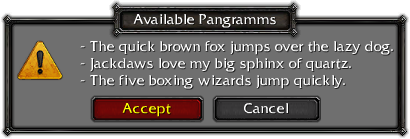
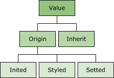

<!--<link href="http://kevinburke.bitbucket.org/markdowncss/markdown.css" rel="stylesheet"></link>-->

# Talon
Talon is UI toolkit for responsive interface building. It allows you:

- Use [XML syntax](#tml) for declarative markup interface
- Apply [CSS dialect](#css) for easy skinning and styling
- Build interface with [responsive layouts](#layouts)
- View interface outside your app with [talon browser](#browser)

## The Basics
Talon determines UI as tree of displayable **Nodes**.

### Node
Node - is main building block, you can teat it as `DisplayObject`.
In core node consist from 4 main parts:

1. Has visible *bounds* (simple rectangle)
3. Can contain children nodes
2. Has *dynamic* set of **Attributes**
4. Can contain attached **Style Sheet** and **Resource Dictionary**

Fore example see next message box:

And such note tree it can has:

<!-- Тут нужно расписать что на картинке и как это соотносится с пунктами 1-4 -->

Let's look at each item details.

### Node visible bounds
Visible bounds is a trivial property which determine region occupied by Node, it is set in the coordinate space of the parent Node.
100% similarly `starling.display.DisplayObject#bounds`.

### Node children
Node is realization of [Composite Pattern](https://en.wikipedia.org/wiki/Composite_pattern) like a `DisplayObjectContainer`.
There is small but unfamiliar difference.
There are two approach to implementation composite pattern:

<!-- Уточнить по GOF эти названия -->
1. Security - base composite object (aka `DisplayObject`) can be only leaf node in trees, and there is another inherit class (aka `DisplayObjectContainer`) which *can* contain another objects.
2. Transparency - base composite object already has methods for work with children (aka `numChildren`, `getChildAt`, `addChild`, etc.)

Any of this ways has pros and cons.
Native flash or starling display tree use first way, but talon Node implement second way.

### Node Attribute
Attribute is named value. The principal rule:
> Attribute *name* and *value* is always **string** values, no exceptions.

This rule give solid basis for all toolkit, but it is not always easy to work with string, for example if you need work with set then array `["one", "two", "three"]` is more comfortable than string `"one two three"`.
Therefore for most used attributes (like `width`, `x`, `classes` and same another) `Node` has strong typed accessors.

#### Name
Attribute name can be any string value: `"id"`, `"width"`, `"y"`, `"alpha"`, `"bla-bla-bla"`, `"1#@!:"`, etc. as you want. Node has a dynamically collection of attributes witch is lazy initialized by request i.e. function [`Node#getOrCreateAttribute(name:String):Attribute`](http://google.com/) always return non-null attribute object (as difined in its name :-)

#### Value
Attribute value has complex calculation algorithm, look at this diagram:

1. `inited` this is a initial value of attribute. For example `width`, `height` set to `"auto"`, `visible` to `"true"`, `backgroundImage` to `"none"`, etc.
2. `styled` this value witch installed from attached style sheet. For example if there is selector `*: { fontColor: #FF0000 }` in attached to node tree style sheet, and there is no other selectors, all nodes (CSS "\*" mean any node) has attribute `fontColor` value equal to `"#FF0000"`.
This value is calculated only if attribute marked as [`Attriubte#isStyleable`](http://google.com/).
3. `setted` this value changed directly from code via [`Node#setAttributeValue(name:String, setted:String)`](http://google.com/), strong typed node attribute accessors like `Node#width`, `Node#margin`, etc. or looking ahead while TML parsing in XML tag attribute `<node attribute="value" />`.
4. `origin` this is first one of previous which is non-null `setted`, `styled`, `inited` (NB! in this sequence): 
	- By default origin equals to `setted` value. 
	- If attribute has no `setted` value (it equals to `null`), used `styled` value. 
	- If also `styled` value equals to `null` used `inited` value. 
	- If in this case `inited` value is also `null`, origin will also be `null`. 
5. `inherit` this is `value` (see next item) of such named attribute from parent node. This behavior defined by CSS (you can read [CSS Paragraph 7.2 Inheritance](https://drafts.csswg.org/css-cascade/#inheriting)), Talon borrow this feature.
This value is calculated only if attribute marked as [`Attriubte#isInheritable`](http://google.com/) 
6. `value` this is resulting value it is equals to `origin`, but if attribute is inheritable and `origin` equals to special *inherit* constant, used `inherit` value.

And there is one special `valueCache` property this is not attribute value in the full sense of the term, but this layer added for resolve next problems:

* Resulting value has complex calculation path.
* Resulting value may be mapped (with special syntax) to resource which can link to other resource and etc. produce long chain, unwinding this chain can be hard process.

But node resource may not be a string value, and therefore `valueCache` is only code sugar.

### Node Resources
Resource Dictionary is simple key-value pair object. Resource key is always string value, resource value may has any type. You can use any object as you wish:
[`Object`](http://help.adobe.com/en_US/FlashPlatform/reference/actionscript/3/Object.html),
[`flash.utils.Dictionary`](http://help.adobe.com/en_US/FlashPlatform/reference/actionscript/3/flash/utils/Dictionary.html),
[`flash.utils.Proxy`](http://help.adobe.com/en_US/FlashPlatform/reference/actionscript/3/flash/utils/Proxy.html) and any other.

Resources can be attached to node, and after there is access to resource via node attribute. 
In order to map resource to attribute `valueCache` you must use special syntax: `$key` or `$('key')` (if key has non alphanumeric characters)

	var node:Node = new Node();
	var resources:Object = {
		"key1":           "string resource",
		"key_2":          42,
		"key with space": [1, 2, 3],
		"\u2203\u262D":   Texture.empty(32, 32)
	};

	// Attach resources to node
	node.setResources(resources);

	// Set attributes 'setted' value
	node.setAttribute("attr1", "$key1");
	node.setAttribute("attr2", "$(key_2)");
	node.setAttribute("attr3", "$('key with space')");
	node.setAttribute("attr4", '$("\u2203\u262D")');

	// Trace attributes 'valueCache' value
	trace(node.getAttributeCache("attr1")); // string resource
	trace(node.getAttributeCache("attr2")); // 42
	trace(node.getAttributeCache("attr3")); // 1, 2, 3
	trace(node.getAttributeCache("attr4")); // [object ConcreteTexture]

All resources are inherit from parent to any children. In most case you may attach it only to root node. But child nodes may has attached resource dictionary too, and in this case can appear collisions: parent and child has resource with some key, in this case child resource have much priority than parent one.

	// Source elements
	var parent:Node = new Node();
	var parentResources:Object = {
		key1: "parentResource1",
		key2: "parentResource2"
	};

	var child:Node = new Node();
	var childResources:Object = {
		key2: "childResource2",
		key3: "childResource3"
	};

	// Add child to parent
	parent.addChild(child);

	// Attach resources to nodes
	parent.setResources(parentResources);
	child.setResources(childResources);

	// Attach resource to child, and set attributes 'setted' value
	child.setAttribute("attr1", "$key1");
	child.setAttribute("attr2", "$key2");
	parent.setAttribute("attr1", "$key3");

	// Trace attributes 'valueCache' value
	trace(child.getAttributeCache("attr1"));  // parentResource1 - used from parent resource dictionary
	trace(child.getAttributeCache("attr2"));  // childResource2 - user from child resources dictionary
	trace(parent.getAttributeCache("attr3")); // null - "$key3" doesn't exist in parent resource dictionary

### Node Style Sheet (CSS)
В названиях аттрбутов используется только *малаяВерблюжьяНотация*, без чёрточек как в W3C/Flex диалектах.
Следующий список аттрибутов используется в движке:

### Layouts
#### Absolute
#### Flow

## TML
> «Списывание с одного источника — плагиат, с двух — компиляция, с трех и более — диссертация»

- XSLT — Это очень мощный инструмент общего пользования, хоть его сложность в разы меньше его мощности всё равно для моих целей он казался ядерной боеголовкой для охоты на уток. Тем не менее основной принцип что xslt - это набор шаблонов и трансформаций связаных с ними я позаимсвовал, но сильно упростив систему трансформации.
- XInclude — был удивлён когда нашёл этот механизм, очень маленький и симпотичный, но как бы это забавно небыло его функционала явно мне не достаточно было - едиственное что он позваляет - включать один xml документ (или его часть) в другой.
- TAL — это было почти точное поподание по функицоналу того что мне нужно было, хотя в ?них? есть немного императивной логики, но они попали в точку - в них ввыводится 4 основных типа изменения дерева - замена контента, замена узла, замена аттрибутов и добавление узлов. Но мне как-то оказался не мила идея использования аттрибутов для шиблонизации, мне как-то больше по душе были синтаксис основаный на тегах как в XSLT и XInclude.

### Базовые принципы
- *Шаблон* — именованное дерево элементов.
- *Элемент* — бывают 2х типов:
	1. Терминальный
	2. Не терминальный — это шаблон и быть может набор перезаписей.
- *Перезапись* — 

Немного увёкшись формальными граматиками мне понравилась та аналогия которую мне удалось провестио
Шаблон - это дерево элементов и возможно набор трансофрмаций над ним
Дерево - состоиз из одельных узлов-элементов
Каждый элемент может быть двух типов - терминалом и не терминалом.
Терминал это примитивный узел который является базовым кирпичиком. (на примере html - это те самые div и span)
Не терминал - это поддерево - шаблон т.е. поддерево и набор трансформаций над ним
Таким образом при сборке интерфейса - это всегда набор только терминальных узлов, но на этапе макета? его можно сильно сжать изпользую шаблоны

### Трансофрмации
- replace
- content
- attributes

### Ключевые теги
Tag-Keywords:
- `rewrite` - replace any subtree on exists tree pattern (consist from 1 child (root) if mode==replace, any count of child if mode==content, empty if mode==attributes)
	+ `ref` - mandatory subtree root id
	+ `mode` - attributes / replace / content
- `template` - create tree pattern (consists from only 1 child (root))
	+ `id` - mandatory
	+ `type` - linkage tag name
- `library` - use as container for define, style и другие
- `style` - use to add css in library (without create addition .css file)

## Browser

## Appendix
### CSS Dialect
