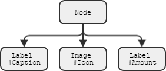

# TML - Template Markup Language
Любой интерфейс удобно описывать иерархической структурой. И в этой структуре часто попадаются шаблонные поддеревья.
Для минимизации с

Наверное каждому из нас не созвавал интерфейс приложения, и частенько приходилось писать что-то в роде этого:

	var label:Label = new TextField();
	label.text = "Press to continue";
	addChild(label);

	var button:Button = new Button();
	button.label = "Continue";
	button.x = label.x;
	button.y = label.y + label.height + 10;
	addChild(button);

У такого подхода много не достатков среди них - громозкость, плохая читаемость и самое главное - жёсткость; если мы захотим поменять/убарть какой-либо элемент нужно будет проверить на нужном ли месте теперь стоят остальные.
Возможно читатель знаком с другим методом создания интерфейсов - декларативным. Есть много языков которые позводяют описывать так - `HTML, MXML, XAML, XUL, FXML` и многие другие.

Каждый из них приводит разработку интерфейсов на другой уровень, с их помощью можно задавать как должен выглядить интерфейс, а не какие элементы куда нужно поставить, что значительно облегчает жизнь программиста.

В идее каждого из них - возможность описания дерева элементов с помощью XML (или любого другого языка). TML создан для тех же самых целей, но в отличии от всех прочих элементов TML не предоставляет большой список доступных элеметов (виджетов), он предоставлятет возможность провести разметку экономя повторные элементы.

Например кнопка, во всех этих языках - кнопка это отдельный элемент с какой-либо связанной логикой и структурой (в некоторых из них структуру можно менять); Или например выпадающий список - таже ситуация.
TML - представляет только минимальный набор из _терминальных_ элементов, на столько базовых на сколько это возможно - контейнер, текстовое поле, картинка. Более сложные элементы - собираются из терминальных, например кнопка покупки:

	<node>
		<button label="Continue" />
		<label text="Press to continue" />
	</node>

Определив такой XML мы получаем следующую структуру кнопки.

 

Ну и примерно такой внешний вид:

## Альтернативы
 - XInclude
 - XSLT
 - TAL (Genshi)

## Содержание/Структура
Терминальный узел - узел который не связан с каким-либо шаблоном, и разбирается как есть.
В отличии от не терминальных узлов которые раскрываются в поддерево.
Любой не терминал подразумевает под собой то что это не просто узел, а поддерево.
Для того чтобы зарегистрировать новый не терминальный узел используется тег <define>.
Поддеревья можно описывать новые, а брать за основу старые и изменять их используя <rewrite>.

Tag-Keywords:
 - `rewrite` - replace any subtree on exists tree pattern (consist from 1 child (root) if mode==replace, any count of child if mode==content, empty if mode==attributes)
	+ `ref` - mandatory subtree root id
	+ `mode` - attributes | replace | content
 - `template` - create tree pattern (consists from only 1 child (root))
	+ `id` - mandatory
	+ `type` - linkage tag name
 - `library` - use as container for <define>, <style>
 - `style` - use to add css in library (without create addition .css file)

### Приоритет выполнения rewrite
 - replace
 - content
 - attributes
